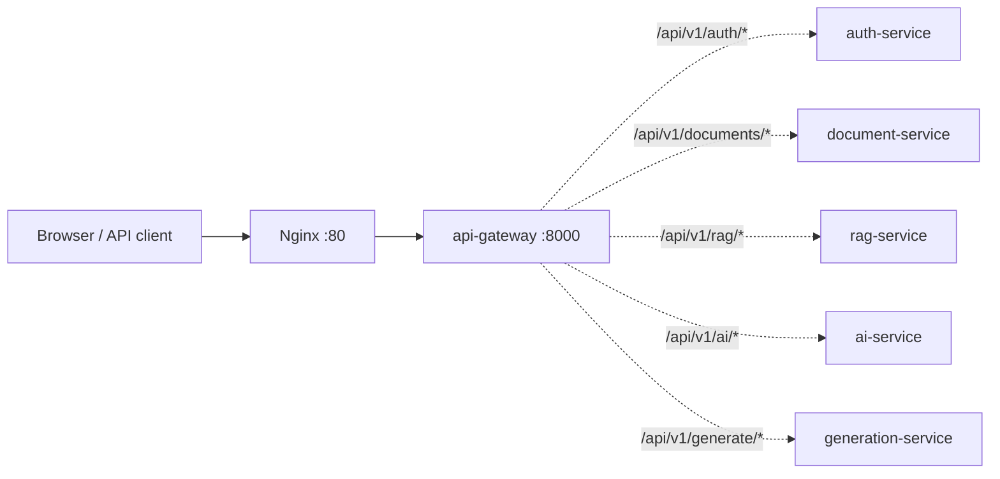

# Архитектура (этап 1)

## Поток запроса

Реализованы **Nginx**, **api-gateway**, **auth-service** (прокси `/api/v1/auth/*`), **document-service** (`/api/v1/documents/*`) и заглушка **rag-service** (`/api/v1/rag/*` для внутренних вызовов). После загрузки файла document-service вызывает `rag-service` для постановки в pipeline индексации (общий volume с файлами).

## Данные

- **PostgreSQL** — пользователи, метаданные документов, сессии refresh-токенов (на этапе auth).
- **Redis** — кэш и rate limiting (позже можно вынести лимиты с in-memory slowapi на Redis).

## Репозиторий

Корень разделён на **`backend/`** (все микросервисы) и **`frontend/`** (клиент). Общая инфраструктура — `docker-compose`, `docker/nginx`.

## Решения

1. **Монорепозиторий** — один PR с контрактами между сервисами, проще на хакатоне, чем N отдельных репо.
2. **Gateway без бизнес-логики** — только маршрутизация, CORS, лимиты, заголовки; авторизация проверяется в сервисах или на gateway через зависимости позже.
3. **Nginx перед gateway** — единая точка для TLS (в проде), лимит размера тела, реальные IP.
