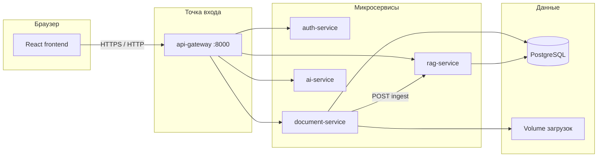

# Полное устройство системы: от загрузки файла до каждой функции

Документ описывает **сквозной поток данных**, **как файлы оказываются «вместе» или отдельно**, **как строится RAG**, и **что делает каждая возможность** в UI. Пути к коду даны относительно корня репозитория.

---

## 1. Общая архитектура

- **Пользователь** работает с **frontend** (Vite + React). Запросы к API идут на **api-gateway** с префиксом `/api/v1/...` и при необходимости заголовком `Authorization: Bearer <JWT>`.
- **document-service** хранит метаданные документов и пути к файлам на диске; вызывает **rag-service** для индексации.
- **rag-service** извлекает текст, **режет на чанки**, строит **индекс** (TF-IDF и/или эмбеддинги), отвечает на **запросы поиска**.
- **ai-service** вызывает **LLM** (Mistral SDK или OpenAI-совместимый HTTP), STT, таблицы, группировку тем при пакетной загрузке.

Подробнее про TLS: в разработке часто HTTP; пример HTTPS с TLS 1.2/1.3 — `docker/nginx/nginx-tls.conf.example`.

---

## 2. Загрузка файлов: два сценария

### 2.1 Один файл: `POST /api/v1/documents/upload`

1. **Проверка** MIME и размера (`document-service`): разрешены **PDF, DOCX, PPTX, TXT** (см. `_ALLOWED_MIME` в `document-service`).
2. Генерируется **UUID документа**, файл пишется в **volume** загрузок (`save_upload`), в PostgreSQL создаётся запись: статус `pending`, **`topic_group_id = null`** (отдельный документ, не связан с другими).
3. Асинхронно вызывается **rag-service** `POST /api/v1/rag/ingest` с `document_id`, `storage_path`, `mime_type` (`rag_client.notify_ingest`).
4. При успешной индексации статус **`ready`**, иначе **`failed`**.
5. Ответ клиенту содержит `id` документа; пользователь может открыть **`/workspace/:documentId`**.

**Итог:** один файл = один документ в БД = один **`document_id`** в RAG = **`topic_group_id` нет** → все функции workspace работают **только с этим файлом**.

---

### 2.2 Несколько файлов: `POST /api/v1/documents/upload-batch`

1. Для **каждого** файла проверка MIME/размера.
2. Если в запросе **ровно один файл** — поведение как у одиночной загрузки (без группировки), см. выше.
3. Если **два и больше файлов**:
   - Для каждого файла запрашивается **короткий превью-текст** через **rag-service** `POST /api/v1/rag/extract-preview` (чтобы не гонять в LLM целиком файлы).
   - Превью + имена файлов отправляются в **ai-service** `POST /api/v1/ai/topic-groups`. Модель возвращает **группы индексов** файлов `[[0,1],[2]]` — кто с кем «в одной теме».
   - Если ответ LLM некорректен или ошибка — **fallback:** каждый файл в **своей** группе `[[0],[1],[2],...]`.
   - Для каждой группы из **≥ 2 файлов** создаётся **один общий `topic_group_id` (UUID)**; для «одиночек» в группе из одного файла — **`topic_group_id = null`** (`assign_topic_group_ids` в `batch_upload.py`).
   - Для **каждого** файла создаётся **свой** документ со **своим** `document_id`, но у соседей по теме **одинаковый** `topic_group_id`.
   - Каждый файл отдельно сохраняется на диск и отдельно вызывается **`rag/ingest`** — в индексе RAG это **разные `document_id`**, просто в метаданных document-service они помечены общей группой.

**Как это видно в UI**

- API отдаёт в карточке документа поле **`group_document_ids`**: список UUID всех документов той же тематической группы (или только текущий, если группы нет).
- В **`DocumentWorkspace`** вычисляется **`ragIds`**: если `group_document_ids` непустой — это **все ID группы**, иначе **`[текущий document.id]`** (`frontend/src/components/workspace/DocumentWorkspace.tsx`).

**Итог:**

| Ситуация | `topic_group_id` | `ragIds` в workspace |
|----------|------------------|----------------------|
| Одиночная загрузка | `null` | `[один id]` |
| Пакет, файл «один в группе» | `null` | `[один id]` |
| Пакет, 2+ файла в одной теме | общий UUID у всех | `[id1, id2, ...]` — **все функции** (чат, саммари, подкаст, …) берут **контекст со всех этих документов** |

Индексация в RAG **всегда по одному документу за вызов**; «вместе» они становятся на уровне **запросов**: в `rag/query` передаётся **список `document_ids`**, и поиск ограничивается чанками только этих файлов.

---

## 3. RAG: от текста файла до поиска

### 3.1 Ingest (`POST /api/v1/rag/ingest`)

1. Читается файл с диска по `storage_path`, **извлекается текст** в зависимости от MIME (PDF — pypdf, DOCX — python-docx, PPTX — python-pptx, TXT — как текст). См. `rag-service/app/services/text_extract.py`.
2. Текст **санитизируется** для БД (`text_sanitize`).
3. Вызывается **`split_text`** (`chunking.py`): режим задаётся **`RAG_CHUNKER`** (`semantic` по умолчанию — абзацы и при необходимости внутренний сплит длинных абзацев; альтернативы `langchain`, `llama_index`, `legacy`).
4. Размер чанков по умолчанию при ingest из document-service: **`chunk_size=600`**, **`overlap=90`** (см. `rag.py` константы `_DEFAULT_*`).
5. Чанки сохраняются в **PostgreSQL** (если `RAG_ENABLE_DB`) и в **in-memory** структуру `InMemoryVectorStore` для поиска.
6. Пересобирается матрица **TF-IDF** (scikit-learn) или, если задан **`EMBEDDER_BASE_URL`**, считаются **эмбеддинги** всех чанков и нормализуются.

У **каждого чанка** в хранилище: **`document_id`**, порядковый **`chunk_id`** внутри документа, **`text`**.

### 3.2 Поиск `POST /api/v1/rag/query`

На вход: текст **`query`**, **`top_k`**, опционально **`document_ids`**.

- Если **`document_ids`** задан — учитываются **только** чанки этих документов (фильтр после или во время скоринга).
- Для каждого чанка считается **score**:
  - **TF-IDF:** косинусное сходство вектора запроса и вектора чанка.
  - **Эмбеддинги:** скалярное произведение нормированных векторов (косинусная близость).
- Сортировка по **убыванию score**, возврат **top_k** пар `(чанк, score)`.

На **frontend** для **чата** при нескольких документах используется **`ragQueryBalanced`**: отдельные запросы по каждому `document_id` с квотой чанков, затем объединение и обрезка — чтобы один файл не «съел» всю выдачу.

### 3.3 Все чанки документа `GET /api/v1/rag/documents/{id}/chunks`

Возвращает чанки **по порядку** `chunk_id` без семантического поиска — удобно для **длинного контекста** (саммари, карточки и т.д.).

---

## 4. Общий контекст для «генераций» (не чат)

Модуль **`frontend/src/lib/workspaceAi.ts`** строит **строку контекста** для большинства функций:

1. Для каждого `documentId` из **`ragIds`** вызывается **`fetchMergedChunks`**:
   - сначала **`GET .../chunks`** (все чанки документа);
   - если пусто — **два** широких `rag/query` с общими формулировками и объединение по `chunk_id`;
   - при пустом индексе — попытка **`reindexDocument`** для первого id.
2. Чанки **склеиваются** по порядку документ → `chunk_id`, обрезаются до **~12000 символов** (`MAX_CTX`).

Эта строка уходит в **промпты** к **`aiChat`** или **`aiExtractTable`** в зависимости от функции.

---

## 5. Поток по каждой функции (workspace)

Ниже: **откуда данные** → **какой API** → **результат в UI**.

Все пути с **`ragIds`** используют **одну и ту же группу документов** (один файл или вся тематическая группа).

| Функция (вкладка / страница) | Источник текста | Вызов | Примечание |
|------------------------------|-----------------|-------|------------|
| **Обзор** — кратко + темы | `contextFromDocuments(ragIds)` | `aiChat` | Автоматически при открытии workspace, статус `ready` |
| **Просто** | `runQuickAction("simple", ...)` → внутри контекст как выше | `aiChat` | Упрощённый пересказ |
| **Кратко** | то же | `aiChat` | Короткая выжимка |
| **Отчёт** | `generateOfficialReport` | `aiChat` | Шаблон официальной справки |
| **Таблица** | контекст из RAG | `aiExtractTable` → **`POST /api/v1/ai/extract-table`** | CSV в UI + скачивание |
| **Чат** | **`ragQueryBalanced`** / `ragQuery` + системный промпт с подписанными чанками | `aiChat` | Источники: выбранные чанки, до 4 при группе |
| **Шаблоны чата** (инвестор, студент, слайд) | отдельный `ragQuery` по шаблонной строке | `aiChat` | Как чат, свой «запрос к индексу» |
| **Тесты** | `runQuickAction("test", ...)` | `aiChat` | Текст теста |
| **Карточки** | `generateFlashcards` | `aiChat` | Вопрос–ответ |
| **Презентация** | контекст | `aiChat` → JSON → **pptxgenjs** (браузер), опционально картинки через gateway | PPTX файл |
| **Видео** | контекст | `aiChat` → JSON сценарий | План сцен, сток-картинки; не финальный монтаж MP4 на сервере |
| **Инфографика** | контекст | `aiChat` с **`json_mode`** → парсинг JSON | График + JSON |
| **Mindmap** | контекст | `aiChat` | Текст иерархии → парсер → **MindmapView** |
| **Подкаст** | контекст | `aiChat` | Сценарий двух ведущих; озвучка — **Web Speech API** в браузере |
| **Пакет ZIP** | агрегирует артефакты | JSZip на клиенте | Архив с текстом RAG, CSV, JSON и т.д. по наличию |

**Reindex** с workspace: `POST /api/v1/documents/{id}/reindex` — повторная **ingest** в RAG с диска (если индекс пуст после рестарта).

---

## 6. Страница «Чат» без конкретного документа (`/chat`)

**`ChatPanel`**: загружается список документов пользователя **`GET /api/v1/documents`**, отбираются **`ready`**, по их **всем `id`** вызывается **`ragQuery` / `ragQueryBalanced`** (если документов несколько) и **`aiChat`**. Контекст **не привязан** к одному workspace — это «вопрос по всем готовым файлам».

---

## 7. Личный кабинет (`GET /api/v1/documents/stats`)

Для **авторизованного** пользователя возвращается агрегат по всем его документам: число файлов, суммарный объём, разбивка по **MIME** с подписями на русском, счётчики статусов (`ready` / `failed` / прочее), число **уникальных `topic_group_id`** (тематические группы), сколько файлов входит в группы и сколько загружено **отдельно** (`topic_group_id` пустой), массив **`topic_groups`** (каждая группа: `topic_group_id`, объём, список участников с `document_id`, именем файла и статусом), даты первой и последней загрузки. Без JWT — **401**. Страница UI: **`/cabinet`**.

---

## 8. Аутентификация и данные

- Регистрация / вход → **JWT**; `auth-service` выдаёт access/refresh.
- Запросы к gateway с **`Authorization: Bearer`**; document-service проверяет владельца документа (кроме режима анонимной загрузки в dev — `ALLOW_ANONYMOUS_UPLOAD`).
- **Конфиденциальность** в архитектуре: свои **Postgres**, **volume** с файлами, возможность поднять **LLM/эмбеддер/STT** в закрытом контуре через переменные окружения (см. `COMPLIANCE_CHECKLIST.md`).

---

## 9. Краткая шпаргалка «как считается»

| Что | Как |
|-----|-----|
| **Чанк** | Кусок текста после `split_text`; границы — абзацы/предложения (режим `semantic`). |
| **Индекс** | TF-IDF по всем чанкам или матрица эмбеддингов (L2-норм). |
| **Score в ответе query** | Косинусная близость запроса и чанка (TF-IDF или эмбеддинги). |
| **Процент в UI** | `score` приведён к [0,1], ×100 — **релевантность поиска**, не «оценка ответа LLM». |
| **Один vs несколько файлов в логике** | Один **`document_id`** в RAG vs список **`ragIds`** в запросах и в контексте для LLM. |
| **Группа темы** | Общий **`topic_group_id`** + список **`group_document_ids`** → один **`ragIds`** в workspace. |

---

## 10. Связанные документы

- Кратко для эксперта по RAG и процентам: [`RAG_EXPERT_BRIEF.md`](RAG_EXPERT_BRIEF.md)
- Соответствие ТЗ: [`TZ_COVERAGE.md`](TZ_COVERAGE.md)
- Чек-лист интеграции: [`COMPLIANCE_CHECKLIST.md`](COMPLIANCE_CHECKLIST.md)
